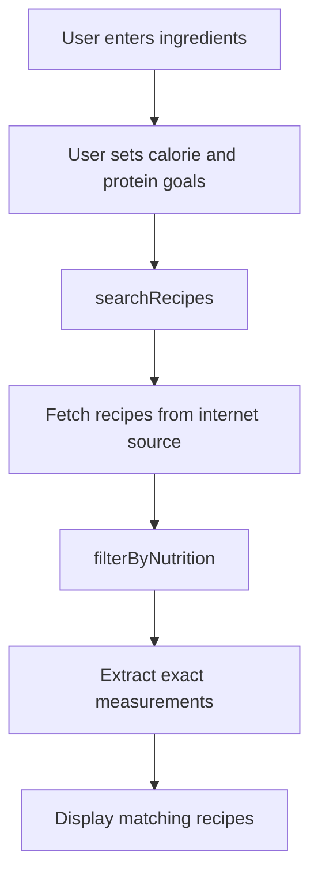

```mermaid
flowchart TD
    A[User enters ingredients] --> B[User sets calorie and protein goals]
    B --> C[searchRecipes]
    C --> D[Fetch recipes from internet source]
    D --> E[filterByNutrition]
    E --> F[Extract exact measurements]
    F --> G[Display matching recipes]
```
